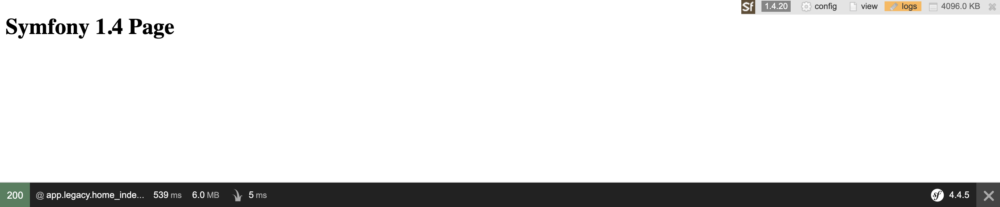
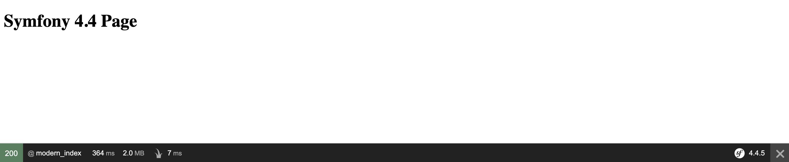

# Symfony Migration (Example)
An exemplary project presenting migration from Symfony 1.4 to Symfony 4.4 using Strangler Pattern

## Project Structure
### Important files
- [config/services.yaml](https://github.com/dkusmierek/symfony_migration_example/blob/master/config/services.yaml)
- [config/routes.yaml](https://github.com/dkusmierek/symfony_migration_example/blob/master/config/routes.yaml)
- [legacy/web/index.php](https://github.com/dkusmierek/symfony_migration_example/blob/master/legacy/web/index.php)
- [src/Controller/LegacyController.php](https://github.com/dkusmierek/symfony_migration_example/blob/master/src/Controller/LegacyController.php)
- [src/Controller/ModernController.php](https://github.com/dkusmierek/symfony_migration_example/blob/master/src/Controller/ModernController.php)
- [src/LegacyRouteLoader.php](https://github.com/dkusmierek/symfony_migration_example/blob/master/src/LegacyRouteLoader.php)

## Legacy Route Loader
The migration is based on a Legacy Route Loader. An approach is described in the articles attached in the [References](#references) section. In short, there is a route loader service implemented in the modern (Symfony 4.4)  application. Route loader is responsible for creating legacy routes. All the routes are serviced by LegacyController
which in turn runs appropriate legacy scripts and returns a response.

## How to run a project?
In order to run a project, there is a Makefile available to simplify this process. To do this please run the following commands ina root directory:
- `make build`
- `make start`

## How does it work?
After starting the application there will be two routes exposed by the server:
- http://localhost/ (it should display a Symfony 1.4 Page)
- http://localhost/modern (it should display a Symfony 4 Page) 

### Production environment
The first one is an index page of Symfony 1.4 framework. It should display simple text `Symfony 1.4 Page`  

  

The second one is a route from Symfony 4.4 framework which should display `Symfony 4.4 Page`

 

### Development environment
On production environment there is no visible difference between both pages (except rendered texts). The difference
is visible on development environment, where a debug mode is enabled. In order to change environment you need to edit 
`.env` file and change `prod` value to `dev`.  

If your environment is set to `dev` you should see:
 
- two web profilers on the Symfony 1.4 page. The legacy one is visible in the top right corner of the page and the 
modern one is visible on the bottom  
  

- The second one (Symfony 4.4) should contain only the modern web profiler  
  

## References
- [Strangler Pattern: How to strangle your legacy system](https://blog.fingo.pl/strangler-pattern-how-to-strangle-your-legacy-system/)
- [Migration Symfony 1.4 to Symfony 4.4 using Strangler Pattern](https://blog.fingo.pl/strangler-pattern-how-to-strangle-your-legacy-system/)
- [Migrating an Existing Application to Symfony](https://symfony.com/doc/current/migration.html)
